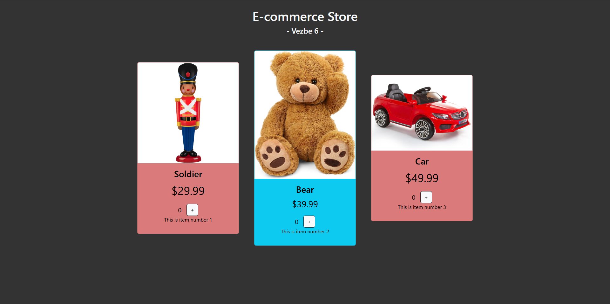

## Exercise 6 - Using Bootstrap with Angular, Template Driven Forms

You can find the implementation of the tasks in the directory `vezbe6/ecommerce` and `vezbe6/template-driven-forms-example`.

Setup instructions for installing bootstrap in angular can be found in the file `vezbe6/setup_bootstrap.md`.

In this exercise we will further upgrade the e-commerce website that can be found in `vezbe5/ecommerce` and demonstrate the use of **bootstrap** with angular (using bootstrap components in angular templates). After that we will implement a simple **template driven form** for adding new products to the website using **ngModel** directive.

### E-commerce Website with Bootstrap

Look at vezbe4 and vezbe5 (the previous exercise) for problem statement. This project is a continuation. No new functionality was added, but the website was styled using bootstrap. In the image below you can see the final look of the page styled with bootstrap.

### Template Driven Forms

In this project we will build a new project with a very simple template driven form to demonstrate the use of **ngModel** directive with **1-way** and **2-way** **data binding**.

- Create a new project.

- Create class `Product` with properties `name`, `imageUrl`, `price` and `type` (new, used or not used).

- Create new component create-product with template containing form for creating new product. Form should contain inputs for all properties of the product class. Set name field to be required.

- Add commit and reset buttons to the form. Commit button should be disabled if the checkbox for accepting terms is not checked. 

- Use ngModel directive to bind inputs to properties of the product class. Use 1-way and 2-way data binding. Product name should always be displayed in uppercase.

- Use state of form css classes to color inputs.
    - Color name in green if it is valid and red if it is invalid.
    - Color imageUrl in green if it is not changed and red if it is changed.
    - Color price in green if it is not touched and red if it is touched.

### How to run this project?

1. Clone this repository to your local machine.
2. Make sure you have followed all of the instructions in `vezbe4/angular_setup.md` to setup nvm, npm, node and angular cli.
3. Open a terminal and navigate to the root directory of the angular project (e.g. `vezbe5/ecommerce`).
4. Run `npm install` to install all dependencies.
5. If you encounter any vulnerabilities, run `npm audit fix` to fix them.
6. Run `ng serve` to start the server.
